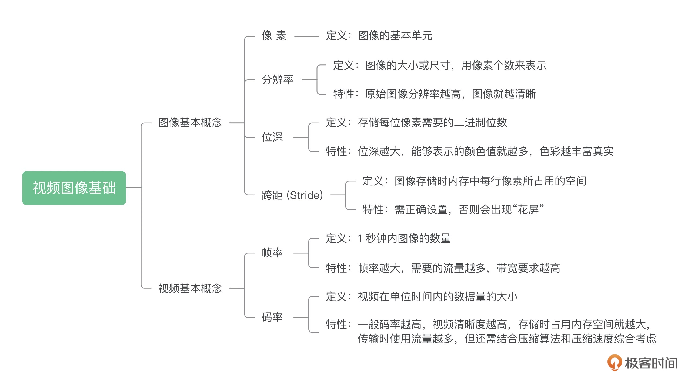
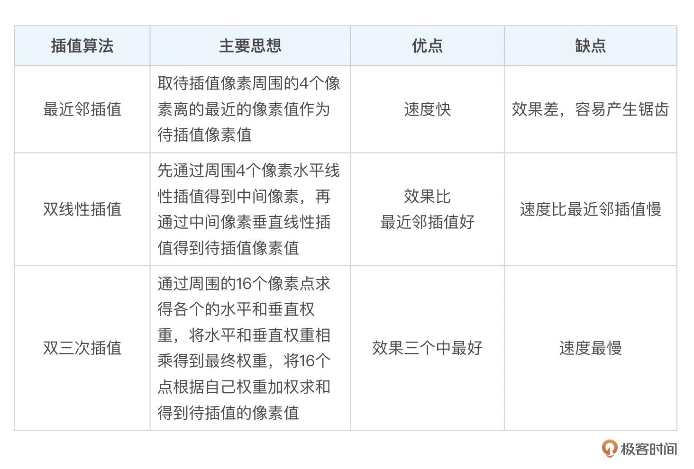
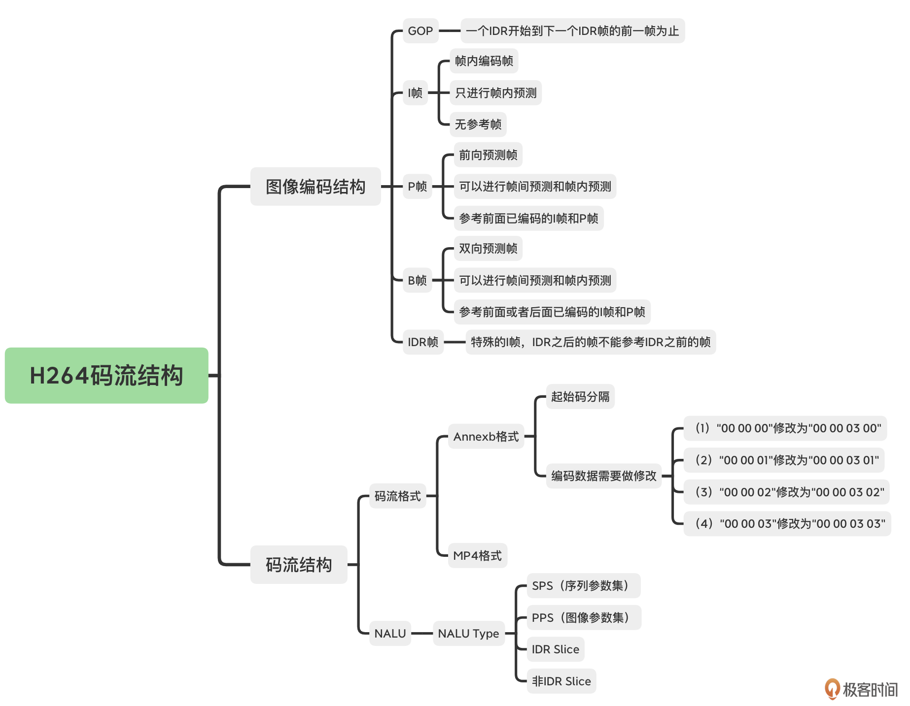
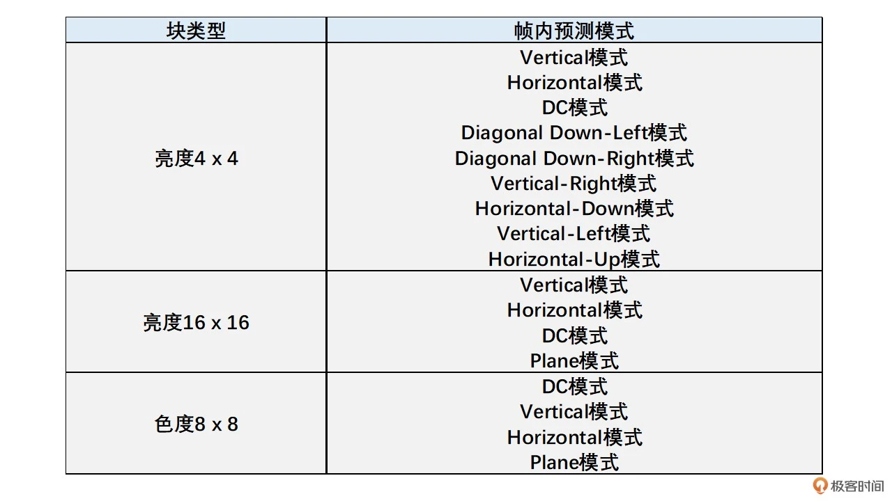
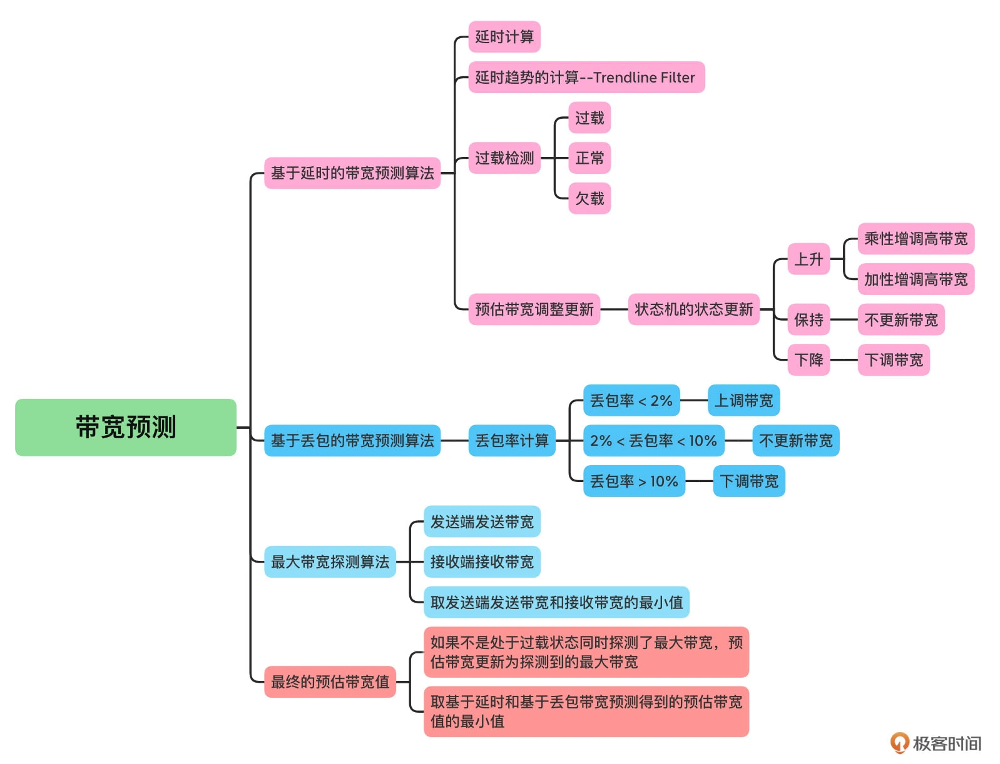
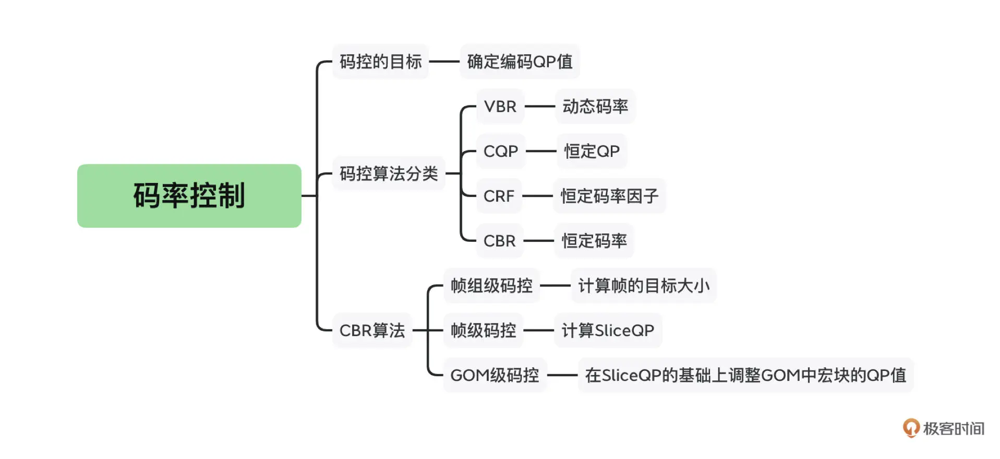
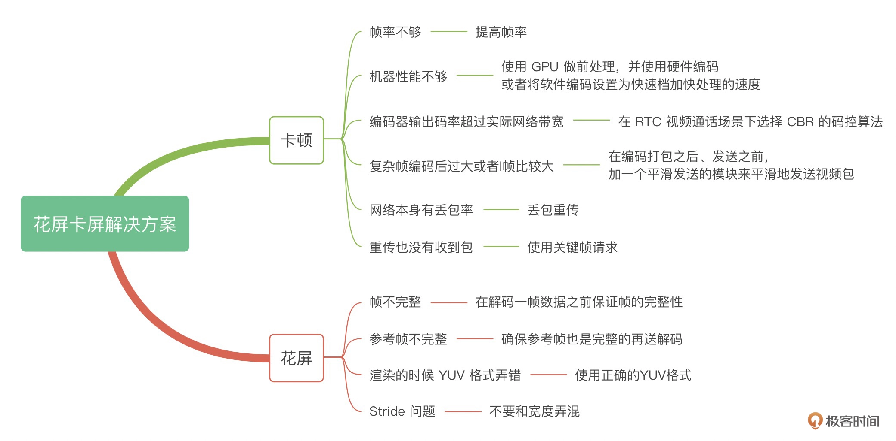

# 01｜基本概念：从参数的角度看视频图像

其实准确来说的话，不是。因为视频的压缩是一个非常复杂的过程，之后我们会有好几节课来讲视频压缩的知识。事实上，视频压缩之后的清晰度还跟压缩时选用的压缩算法，以及压缩时使用的压缩速度有关。压缩算法越先进，压缩率就会越高，码率自然就会越小。压缩速度越慢，压缩的时候压缩算法就会越精细，最后压缩率也会有提高，相同的清晰度码率也会更小。

今天我们学习了图像和视频的基础知识，都很简单但很重要，这里我为你总结了一张图帮助你记忆。



总结来说，一张图像是由像素组成的，而图像有多少像素则由分辨率来表示。在分辨率之外，存取一副图像还需要特别注意 Stride 这个东西，它跟分辨率中的 Width 是不一样的。然后，一帧帧图像组成了视频，我们将每秒中的图像数量称之为帧率。视频编码后每秒的数据量称之为码率。

这些知识点是我们之后课程的基础，随着我们不断深入学习，还会不断巩固这些概念。

# 02｜YUV & RGB：原来图像是这么丰富多彩的

这里就涉及到 Color Range 这个概念。Color Range 分为两种，一种是 Full Range，一种是 Limited Range。Full Range 的 R、G、B 取值范围都是 0～255。而 Limited Range 的 R、G、B 取值范围是 16～235。

BT709 和 BT601 定义了一个 RGB 和 YUV 互转的标准规范。只有我们都按照标准来做事，那么不同厂家生产出来的产品才能对接上。BT601 是标清的标准，而 BT709 是高清的标准

图像的颜色空间主要有 RGB 和 YUV 两种。其中 RGB 图像每一个像素有 R、G、B 三个值。而 YUV 图像有３种类型，其分类如下：

1. YUV 4:4:4，一个 Y 对应一个 U 和一个 V；

2. YUV 4:2:2，左右两个 Y 对应一个 U 和一个 V；

3. YUV 4:2:0，上下左右四个 Y 对应一个 U 和一个 V。

   

同时，YUV 在存储的时候也有两种大类：一种是 Planar 格式；一种是 Packed 格式。其中 Planar 格式又分为先存 U 还是先存 V 两种。而 Packed 格式是 UV 交错存储且分为 U 在前还是 V 在前两种。

在图像采集的时候我们一般得到的原始图像是 RGB 图像，并且渲染的时候最终也是用 RGB 图像，而在编 / 解码时用的却是 YUV 图像。因此，我们需要在 RGB 和 YUV 之间互转。转换的标准有两种：一种是 BT601；一种是 BT709。

另外，在转换过程中我们还涉及到 Color Range 这个概念。Full Range 的 R、G、B 三个值的范围都是 0～255。而 Limited Range 的取值范围是 16～235。在做转换的时候我们需要选择正确的标准和 Color Range。

最后，我再一次提出了 Stride 这个概念。在读取 YUV 图像一行像素的时候一定要区分 Width 和 Stride 的区别。Width 是原始图像的宽，而 Stride 是对齐之后的一行像素使用的字节大小。这个一定要注意，千万不要弄错了。

# 03｜缩放算法：如何高质量地缩放图像？

图像缩放主要包括两个部分：一个是像素位置映射过程；一个是映射位置像素的插值过程。

### 1. 像素位置映射过程

对于分辨率为 w0 x h0 的原图像，我们需要缩放到分辨率为 w1 x h1 的目标图像。我们只需要将目标图像的每一个像素点（x，y）映射到原图像的（x * w0 / w1，y * h0 / h1）位置。一般这个映射位置不是一个整数位置。我们需要通过插值算法得到映射位置的像素值，然后将映射位置插值得到的像素值赋值给目标像素就可以了。

### 2. 映射像素的插值过程

插值过程主要会使用到插值算法。我们今天介绍了最常用的三种插值算法，分别是最近邻插值、双线性插值和双三次插值算法。三种算法的思想和优缺点如下表所示。



# 04｜编码原理：视频究竟是怎么编码压缩的？

RGB 三个颜色是有相关性的，为了去掉这个相关性，减少需要编码的信息量，我们通常会把 RGB 转换成 YUV，也就是 1 个亮度分量和 2 个色度分量

视频编码主要分为熵编码、预测、DCT 变换和量化这几个步骤。

1. 熵编码（以行程编码为例）：视频编码中真正实现“压缩”的步骤，主要去除信息熵冗余。在出现连续多个 0 像素的时候压缩率会更高。
2. 帧内预测：为了提高熵编码的压缩率，先将当前编码块的相邻块像素经过帧内预测算法得到帧内预测块，再用当前编码块减去帧内预测块得到残差块，从而去掉空间冗余。
3. 帧间预测：类似于帧内预测，在已经编码完成的帧中，先通过运动搜索得到帧间预测块，再与编码块相减得到残差块，从而去除时间冗余。
4. DCT 变换和量化：将残差块变换到频域，分离高频和低频信息。由于高频信息数量多但大小相对较小，又人眼对高频信息相对不敏感，我们利用这个特点，使用 QStep 对 DCT 系数进行量化，将大部分高频信息量化为 0，达到去除视觉冗余的目的。

这里你需要注意的是，视频编码实际的步骤是预测、DCT 变换和量化，最后是熵编码。经过这几步操作之后，视频中的冗余信息大部分被去除，达到了编码压缩的效果。

# 05｜码流结构：原来你是这样的H264

为了避免错误的不断传递，就有了一种特殊的 I 帧叫 IDR 帧，也叫立即刷新帧。

我们可以看到 GOP 的大小是由 IDR 帧之间的间隔来确定的，而这个间隔我们有一个重要的概念来表示，叫做关键帧间隔

GOP 不是越大越好，也不是越小越好，需要根据实际的场景来选择。

这节课我们主要讨论了 H264 的编码层次结构和码流结构。在一个视频图像序列中，我们将其划分成一个个 GOP。GOP 包含一个 IDR 帧到下一个 IDR 帧的前一帧中的所有帧。GOP 的大小选择需要根据实际应用场景来选择，一般 RTC 和直播场景可以稍微大一些，而点播场景一般小一些。

在 H264 中，每一帧图像又可以分为 I 帧、P 帧和 B 帧，而 I 帧又包含了普通 I 帧和 IDR 帧。帧可以划分为一个或者多个 Slice，并且最后帧都是以 Slice 的方式在码流中呈现。同时 H264 码流中除了 Slice 数据之外，还有 SPS 和 PPS 两个参数集，分别用来存放基础图像信息和基础编码参数。SPS 和 PPS 非常重要，如果丢失了，将无法进行解码。

每一个 Slice 和 SPS、PPS 都是通过 NALU 来封装的，且 NALU 含有一个 1 字节的 NALU Header。我们可以通过 NALU Header 中的 NALU Type 来判断 NALU 的类型。同时，每一个 NALU 的分隔有两种方式：一种是 Annexb 格式，通过使用起始码分隔；一种是 MP4 格式，通过一个 4 字节的长度来表示 NALU 的大小，从而起到分隔的作用。

为了帮助你记忆，我们通过下图来总结一下。



# 06｜帧内预测：如何减少空间冗余？

已经编码的块会解码成像素用来做参考像素

一幅图像中相邻像素的亮度和色度信息是比较接近的，并且亮度和色度信息也是逐渐变化的，不太会出现突变。也就是说，图像具有空间相关性。帧内预测就是利用这个特点来进行的。即帧内预测通过利用已经编码的相邻像素的值来预测待编码的像素值，最后达到减少空间冗余的目的。

宏块大小是 16 x 16，其中亮度块为 16 x 16，色度块为 8 x 8； 帧内预测中亮度块和色度块是分开独立进行预测的，即亮度块参考已编码亮度块的像素，而色度块参考已编码色度块的像素； 16 x 16 的亮度块可以继续划分成 16 个 4 x 4 的子块。

DC 模式就是指，当前编码亮度块的每一个像素值，是上边已经编码块的最下面那一行和左边已编码块右边最后一列的所有像素值的平均值

三种方案选择最优预测模式:

第一种方案，先对每一种预测模式的残差块的像素值求绝对值再求和，称之为 cost，然后取其中残差块绝对值之和也就是 cost 最小的预测模式为最优预测模式。 第二种方案，对残差块先进行 Hadamard 变换（在 DCT 变换和量化那节课中会介绍），变换到频域之后再求绝对值求和，同样称为 cost，然后取 cost 最小的预测模式为最优预测模式。 第三种方案，也可以对残差块直接进行 DCT 变换量化熵编码，计算得到失真大小和编码后的码流大小，然后通过率失真优化（作为课外内容自行学习，这里不展开讨论）的方法来选择最优预测模式。 为了让你更容易理解第三种方案，这里我稍微简单介绍一下率失真优化的思想。

我们主要是一起聊了聊帧内预测。我们先详细讲述了有哪几种预测模式，以及各种预测模式的预测块的计算方法。同时强调一点，就是有的模式在参考像素不存在的时候是无效的，也就是不能使用的。这一点需要注意，并不是列举出来的每一个模式都是可以使用的。

为了方便你记忆，下面我把每一种块和子块支持的预测模式用一个表格来总结一下。



最后，我们还简单介绍了一下预测模式的选择方法，主要有计算残差块绝对值之和、将残差块做 Hadamard 变换之后再求和、率失真优化等几种方案来得到 cost，然后我们取 cost 最小的模式作为帧内预测模式。

# 07｜帧间预测：如何减少时间冗余？

WebRTC 中，P 帧中的所有块都参考同一个参考帧。并且一般会选择当前编码帧的前一帧来作为参考帧。

钻石搜索算法:

（1）从搜索的起始点开始，以起始点作为菱形的中心点。首先以该中心点为左上角像素的 16 x 16 的块作为预测块，求得残差块并求得像素绝对值之和，也就是 SAD。之后对菱形 4 个角的 4 个点分别做同样的操作求得 SAD 值。得到最小的 SAD 值，最小 SAD 值对应的点就是当前最佳匹配点。 

（2）如果最佳匹配点是菱形的中心点，那我们就找到了预测块了，搜索结束。 

（3）如果最佳匹配点不是菱形的中心点，则用以当前最佳匹配点为中心点的菱形继续搜索，重复之前的步骤直到菱形的中心点为最佳匹配点。

我们一般会通过相邻已经编码块的运动矢量来预测当前块的运动矢量。这个预测的运动矢量也经常用做搜索的起点。

它搜索到的预测块不一定是全局最优预测块，也就是说不一定是最相似的块，有可能是局部最优预测块。

怎么选择呢？其实是在整像素运动搜索的基础上，再做一次精细化的亚像素运动搜索。

编码块帧间模式的选择其实就是参考帧的选择、运动矢量的确定，以及块大小（也就是块划分的方式）的选择，如果 SKIP 单独拿出来算的话就再加上一个判断是不是 SKIP 模式

注意，帧间模式的选择大多数是看编码器的实现的，并且不同编码器实现都会不一样，所以我们只是讲讲其中一种模式选择的思路，具体的细节各个编码器都各不相同。具体选择过程如下：

我们通过一步步分析如何在参考帧中准确地找到预测块的方式，讲解了帧间预测中最重要的一些知识点。其主要包括以下 5 个方面：

1. 宏块的划分。为了能够更准确的找到预测块，我们可以将 16 x 16 的宏块继续划分成更小的子块来做运动搜索。因为图像有的地方静止的背景画面或者平坦的区域可以直接选用最大的块来搜索预测块；而有的地方细节很多，图像中的物体运动方向也各不相同，可能就需要划分成更小的块来做运动搜索。这样每一个块都拥有自己独立的运动矢量，并且得到的预测块更接近于编码块，从而有利于提高压缩效率。
2. 参考帧和运动矢量。在 RTC 场景中我们一般选择单参考，并且一般选择当前编码图像的前一帧作为参考帧。运动矢量是用来表示参考帧中预测块与编码帧中编码块位置的相对距离的。
3. 运动搜索。运动矢量是通过运动搜索得到的，而运动搜索是在参考帧中进行的。通常我们会使用钻石搜索和六边形搜索等快速运动搜索算法。一般不会使用全搜索算法。其中钻石搜索算法更简单，步骤更少，所以如果需要编码速度快，一般选择钻石搜索。六边形搜索步骤更多，更精细，要求编码质量高，同时对速度要求不高的时候，可以选择六边形搜索。
4. 亚像素插值和亚像素精度搜索。光做整像素运动搜索不太能够准确的处理连续运动场景。为了能够处理好这种连续运动的问题，我们对参考帧进行亚像素插值得到半像素和 1/4 像素图像。然后在整像素搜索的基础上在亚像素图像上做亚像素精度的运动搜索。实验数据证明，半像素和 1/4 像素精度的运动搜索相比整像素精度的运动搜索可以明显地提高压缩效率。
5. 在最后我们大体讲了一下编码块帧间预测模式的具体选择过程，并单独讲解了一下 SKIP 模式。SKIP 模式是一种比较特殊的模式，由于 MVD 和残差块都是等于 0，因此其压缩效率特别高。

最后，我再次强调一下，今天的课程内容非常多。你需要多看几遍才能有比较好的理解。如果你是视频编码的应用工程师的话，掌握其中的思想就可以了；如果你是视频编码算法工程师的话可以先阅读几遍文章，之后再通过阅读编码器具体代码来熟练掌握。实际上，真正的帧间预测过程要比我讲述的内容复杂的多，有很多繁琐的细节，同时每一个编码器的具体实现也不一样，需要你自己课后慢慢学习。

参考文献：

https://blog.csdn.net/leixiaohua1020/article/details/45936267。

这篇文章中雷霄骅大神针对 H264 的帧间预测原理和 x264 中对应的代码做了非常详细地讲解。在这里非常感谢雷神对视频技术做出的贡献，以及无私地分享视频技术知识。雷神也是我学习视频技术路上的导师。在这里向雷神致敬。

# 08｜变换量化：如何减少视觉冗余？

不管宏块有没有被划分到 4x4 的子块，我们在做 DCT 变换时，都是在一个个 4x4 块上进行的

我们称左上角的系数为 DC 系数，而其它系数为 AC 系数

其实量化的操作并不是针对 AC 系数去做的，DC 系数也同样会做量化，只是通常情况下，DC 系数比较大，从而量化后变换为 0 的概率比 AC 系数要小

通常 QStep 值越大，DC 系数和 AC 系数被量化成 0 的概率也就越大，从而压缩程度就越大，但是丢失的信息也就越多。这个值太大了会造成视频出现一个个块状的效应，且严重的时候看起来像马赛克一样；这个值比较小的话，压缩程度也会比较小，从而图像失真就会比较小，但是压缩之后的码流大小就会比较大

实际上 H264 里面的变换和量化是这样的吗？原理上是的，但是实际计算过程变了。因为 DCT 变换过程中涉及到浮点运算，在不同机器上解码会因为精度问题产生漂移导致误差。同样，量化过程有除法运算，大多数时候其结果还是浮点型的数字，在不同机器上解码也会有误差

我们今天一开始主要讲解了 DCT 变换的基本原理。DCT 变换主要是将图像从空域转换到频域，并将图像的高频和低频信息分离开来。虽然高频信息数据多，但是幅值比较小。这样高频信息在量化的过程中能够比较容易被减少。这样可以比较有效地减少图像的视觉冗余，从而达到压缩的目的。

接着，我们简单地介绍了一下量化的原理。量化其实就是一个除法操作。通过除法操作就可以将幅值变小，而高频信息幅值比较小，就比较容易被量化成 0，这样就能够达到压缩的目的。

在讲变换的原理的时候，我们还讲到了一个前面提到了好几次的 Hadamard 变换。Hadamard 变换在 H264 的 16x16 帧内亮度块和 8x8 色度块中会被用到。但是 Hadamard 在率失真优化做模式选择的时候使用的更多。基本上各种视频编码都或多或少会用到它来做率失真优化。

在 H264 标准中，我们不会直接使用标准的 DCT 变换和量化。为了减少多次浮点型运算在解码端产生漂移的问题，H264 使用整数变换代替 DCT 变换。DCT 变换中的浮点运算部分跟量化过程进行合并，将两次浮点型运算变成一次，从而减少误差。

在最后，我们简单介绍了 H264 标准中不同模式亮度块和色度块的 DCT 变换和量化的过程。其中需要注意的就是亮度 16x16 帧内预测块和色度 8x8 的 DC 系数会单独拿出来组成一个新的 DC 块，我们会先对这个 DC 块进行 Hadamard 变换之后再做量化操作。

# 09｜RTP & RTCP：如何正确地将视频装进RTP中？

TCP 协议更适合传输文本和文件等数据，而不适合传输实时音频流和视频流数据，所以我们通常会使用 UDP 协议作为音视频数据的传输层协议

首先，我们一起讨论了 RTP 协议和 RTCP 协议的主要作用。RTP 协议用来封装音视频数据，并且将音视频数据和一些基本信息打包到 RTP 包中传输到接收端。而 RTCP 协议则辅助 RTP 协议使用，其中一个主要的功能就是用来统计 RTP 包的发送情况，比如说丢包率和具体哪些 RTP 包在网络发送的过程中丢失了。RTCP 包将这些信息收集起来发送给 RTP 包的发送端。

然后，我们说明了 RTP 和 RTCP 协议是带宽预测和拥塞控制的基础，并且重点强调了 RTCP 协议本身只统计信息，而带宽预测和拥塞控制算法是需要我们自己实现的，RTCP 协议本身并没有这个功能。

最后，我们介绍了 H264 的 RTP 打包方式，总共有三种，分别是单 NALU 封包方式、组合封包方式和分片封包方式。

- 单 NALU 封包方式，一般适合 NALU 大小比较小，且打包出来的 RTP 大小小于 1500 字节的时候使用。
- 组合封包方式，适合多个 NALU 都很小，且合并在一起打包的 RTP 包小于 1500 字节的时候使用。
- 分片打包，则适合 NALU 比较大的情况，且打包成一个 RTP 包其大小会大于 1500 字节的时候使用。
  这几种打包方式不是说只能选择一种，在一个 RTP 流中是可以存在多种打包方式的，即可以混合使用。

最后再一次强调，这节课和 H264 码流结构那节课都是非常重要的。它们在实际视频开发的过程中会经常用到，希望你可以熟练掌握。

# 10｜带宽预测：3大算法准确预估网络带宽



WebRTC 中带宽预测主要分为基于延时的带宽预测算法、基于丢包的带宽预测算法以及最大带宽探测算法。

基于延时的带宽预测算法主要是解决网络中含有大缓冲网络设备场景的带宽预测。基于丢包的带宽预测算法主要是解决网络中有小缓冲或无缓冲网络设备场景的带宽预测。最终预估带宽等于这两者预测到的带宽值中的最小值。

同时，为了防止出现发送码率大幅低于实际网络带宽而导致网络带宽预估偏低的问题，我们还引入了最大带宽探测算法，可以周期性的探测网络的最大带宽。如果当前网络不是处于过载状态同时又探测到了最大带宽的话，就将预估带宽更新为探测到的最大带宽。

# 11｜码控算法：如何控制视频的编码码率？

那码控的原理是什么呢？其实码控就是为每一帧编码图像选择一个合适的 QP 值的过程。

CRF码控算法思想。它的思想是：运动很大的时候，人眼不太关注细节，因此 QP 可以稍微大一点；运动比较小的时候，人眼会将注意力放在细节上面，因此 QP 稍微小一点。所以相比 CQP，CRF 能够更省码率一些。但是 CRF 码控总体上得到的编码后图像的大小，还是随着图像的画面复杂度在变化的。因此，我觉得 CRF 也算是一种特殊的 VBR。

用宏块的方差作为复杂度。我们计算 I 帧的复杂度的时候，是求每一个宏块的方差，最后将帧的所有宏块的方差之和作为帧的复杂度。

上面的公式是什么意思呢？其实大体的思想就是：一帧编码后的大小应该是和帧的复杂度成正比的，并且跟帧使用的 QStep 是成反比的。但是具体成多少比例怎么知道呢？

这节课我们主要讨论了码控算法，带你了解了一下码控算法的原理和基本类型。码控主要是为每一帧图像确定 QP 值的过程。如果在图像画面确定的情况下，并且 QP 值确定了的话，那当前图像编码后的大小就大致确定了，从而编码后的码率大小也基本确定了。

同时，常用的码控算法主要有 CQP、CRF、VBR 和 CBR。并且，我们还对 CBR 进行了深入地探讨。我们知道了 CBR 主要分为：帧组级、帧级和 GOM 级三个级别的调整，并通过一步步不断精细化的调整最后尽量达到恒定码率的目标。

你可以通过下面的图来对这节课加强理解和记忆。



# 12｜Jitter Buffer：拿什么拯救你，花屏卡顿问题

丢包重传请求策略是在 Jitter Buffer 里面实现的

I 帧请求使用 RTCP 协议中的 FIR 报文。这个策略也是工作在 Jitter Buffer 中的。

我们今天主要介绍了哪些环节出现问题会比较容易引起卡顿和花屏，并给出了相应的解决方法。

### 1. 卡顿

- 在采集或设置的帧率不够时，会造成两帧之间的时间间隔过长，从而导致卡顿。我们需要提高帧率。
- 机器性能不够，导致前处理或者编码耗时太长，从而导致卡顿。我们可以在高分辨率的时候尽量使用 GPU 做前处理，并使用硬件编码或者将软件编码设置为快速档加快处理的速度。
- 编码器输出码率超过实际网络带宽。在 RTC 视频通话场景下我们最好选择 CBR 的码控算法，从而保证输出码率能够比较好地贴合预估带宽。
- 复杂帧编码后过大或者 I 帧比较大，如果一次性将这种大帧打包出来的所有包都直接发送到网络中，容易引起网络丢包，继而引起卡顿的可能。为了能够减小这种大帧带来的瞬时网络波动，我们可以在编码打包之后、发送之前，加一个平滑发送的模块来平滑地发送视频包。这个模块在 WebRTC 中叫做 PacedSender。它的主要工作原理就是编码输出的码流打包之后先放到它的缓冲区中，而不是直接发送。
- 网络本身就有一定的丢包率，如果视频帧出现了丢包的话，帧就不完整了，那么当前帧也就不能拿去解码，可能引起卡顿。最常用的方法就是丢包重传。丢包重传请求策略是在 Jitter Buffer 里面实现的。
- 重传也没有收到包，导致帧不完整，继而导致没有帧可以解码成功，我们就需要使用关键帧请求，也叫 I 帧请求。I 帧请求使用 RTCP 协议中的 FIR 报文。这个策略也是工作在 Jitter Buffer 中的。

### 2. 花屏

- 帧不完整。如果帧出现了丢包就送去解码的话，若能解码成功，那肯定会出现解码花屏的问题。因此，我们在解码一帧数据之前一定要保证帧是完整的。记住我们在 RTP 打包的时候是以 Slice 为单位打包的，而不是以帧为单位打包的。我们也是在 Jitter Buffer 中来对帧进行完整性判断的。
- 参考帧不完整。我们需要参考帧也是完整的才能送解码。如果参考帧不完整或者丢失，会出现花屏。这部分功能一般也是实现在 Jitter Buffer 中。
- 渲染的时候 YUV 格式弄错了，也会造成花屏。其处理方式也很简单，就是使用正确的 YUV 格式就对了。
- Stride 问题会造成花屏。我们解码后渲染前一定要处理好 YUV 的 Stride 问题，不要和宽度弄混了。

为了方便你记忆，这里我给出了一张总结图。



# 13｜SVC：如何实现视频编码可伸缩？

SVC 编码，也叫做可伸缩视频编码。它的作用是可以实现在一个码流里面包含多个可解码的子码流，服务器可以根据接收端的网络状况，下发对应码率的码流，从而实现可伸缩性。

它通过调整参考帧结构就能实现分层编码。低层的帧不会参考高层的帧。

总结一下，今天我们通过多人视频会议如何设置编码码率的问题引出了为什么需要使用 SVC 编码。SVC 编码可以在一个码流当中包含多个可以解码的子码流，这样服务器就可以根据接收端的带宽转发合适码率的子码流给接收端，从而达到可伸缩性。

并且，我们还介绍了两种类型的 SVC，主要包括时域 SVC 和空域 SVC。在之后，我们对服务器如何做时域 SVC 码流的转发做了详细的介绍。同时，我们还讨论了如何在 RTP 协议里面携带 SVC 信息，用于服务器做转发逻辑和接收端做解码性判断使用。

我们知道服务器会预测得到每一个接收端和服务器之间链路的带宽值，并通过计算 RTP 包的大小和当前 RTP 包携带的层号得到每一层对应的码率。然后，服务器再根据到接收端之间链路的带宽值和对应的每一层的码率来选择到底转发几层。

最后，接收端再根据 RTP 包携带的 SVC 信息来判断帧组完整之后可不可以解码，可以解码才能送解码器，不然就不能送去解码，防止出现花屏。这样我们就实现了可伸缩编码。

# 14｜MP4 & FLV：不要再说AVI了

今天，我们主要介绍了一下两种音视频封装格式，分别是 FLV 和 MP4。这两种封装格式是我们工作和生活中经常需要用到的。

- FLV 在流媒体场景经常会用到，其实直播 RTMP 协议和 HTTP-FLV 协议里面也是用的 FLV 封装，所以还是很重要的。
- MP4 封装就是平时视频文件最常用的封装了，它主要由一个个 box 组成，其中最重要的就是跟 sample 有关的 box，你需要重点掌握。当然你也不需要背下来，了解主要思想即可，等真正用到的时候查询一下就可以了。思考题

# 15｜音画同步：如何让声音和画面手拉手前进？

```c++

/* called to display each frame */
static void video_refresh(void *opaque, double *remaining_time)
{
    ......
    if (is->video_st) {
retry:
        if (frame_queue_nb_remaining(&is->pictq) == 0) {
            // nothing to do, no picture to display in the queue
        } else {
            double last_duration, duration, delay;
            Frame *vp, *lastvp;
            /* dequeue the picture */
            lastvp = frame_queue_peek_last(&is->pictq); // lastvp是指当前正在播放的视频帧
            vp = frame_queue_peek(&is->pictq); // vp是指接下来紧接着要播放的视频帧
            if (vp->serial != is->videoq.serial) {
                frame_queue_next(&is->pictq);
                goto retry;
            }
            if (lastvp->serial != vp->serial)
                is->frame_timer = av_gettime_relative() / 1000000.0;
            if (is->paused)
                goto display;
            /* compute nominal last_duration */
            // last_duration是lastvp也就是当前正在播放的视频帧的理论应该播放的时间，
            // last_duration = vp->pts - lastvp->pts。
            last_duration = vp_duration(is, lastvp, vp); 
            
            // compute_target_delay根据视频和音频的不同步情况，调整当前正在播放的视频帧的播放时间last_duration，
            // 得到实际应该播放的时间delay。
            // 这个函数是音视频同步的重点。
            delay = compute_target_delay(last_duration, is);
            time= av_gettime_relative()/1000000.0;
            
            // is->frame_timer是当前正在播放视频帧应该开始播放的时间，
            // is->frame_timer + delay是当前正在播放视频帧经过音视频同步之后应该结束播放的时间，也就是下一帧应该开始播放的时间，
            // 如果当前时间time还没有到当前播放视频帧的结束时间的话，继续播放当前帧，并计算当前帧还需要播放多长时间remaining_time。
            if (time < is->frame_timer + delay) {
                *remaining_time = FFMIN(is->frame_timer + delay - time, *remaining_time);
                goto display;
            }
            
            // 如果当前正在播放的视频帧的播放时间已经足够了，那就播放下一帧，并更新is->frame_timer的值。
            is->frame_timer += delay;
            if (delay > 0 && time - is->frame_timer > AV_SYNC_THRESHOLD_MAX)
                is->frame_timer = time;
            SDL_LockMutex(is->pictq.mutex);
            if (!isnan(vp->pts))
                // 用当前视频帧的pts更新视频时钟
                update_video_pts(is, vp->pts, vp->pos, vp->serial);
            SDL_UnlockMutex(is->pictq.mutex);
            if (frame_queue_nb_remaining(&is->pictq) > 1) {
                Frame *nextvp = frame_queue_peek_next(&is->pictq);
                // duration是当前要播放帧的理论播放时间
                duration = vp_duration(is, vp, nextvp);
                // 如果视频时钟落后音频时钟太多，视频帧队列里面待播放的帧的播放结束时间已经小于当前时间了的话，就直接丢弃掉，快速赶上音频时钟
                if(!is->step && (framedrop>0 || (framedrop && get_master_sync_type(is) != AV_SYNC_VIDEO_MASTER)) && time > is->frame_timer + duration){
                    is->frame_drops_late++;
                    frame_queue_next(&is->pictq);
                    goto retry;
                }
            }
            ......
            frame_queue_next(&is->pictq);
            is->force_refresh = 1;
            if (is->step && !is->paused)
                stream_toggle_pause(is);
        }
display:
        /* display picture */
        if (!display_disable && is->force_refresh && is->show_mode == SHOW_MODE_VIDEO && is->pictq.rindex_shown)
            video_display(is);
    }
    ......
}

```

```c++

static double compute_target_delay(double delay, VideoState *is)
{
    double sync_threshold, diff = 0;
    /* update delay to follow master synchronisation source */
    if (get_master_sync_type(is) != AV_SYNC_VIDEO_MASTER) {
        /* if video is slave, we try to correct big delays by duplicating or deleting a frame */
        // get_clock(&is->vidclk)是获取到当前的视频时钟，视频时钟 = 当前正在播放帧的pts + 当前播放帧已经播放了的时间。
        // get_master_clock(is)是获取到当前的音频时钟（在视频同步到音频方法的时候），
       // 音频时钟 = 当前正在播放音频帧的播放结束时间 - 还未播放完的音频时长。
       // diff等于视频时钟相比音频时钟的差值；
       // diff > 0 表示视频快了；
       // diff < 0 表示视频慢了。
        diff = get_clock(&is->vidclk) - get_master_clock(is);
        /* skip or repeat frame. We take into account the delay to compute the threshold. I still don't know if it is the best guess */
        // delay就是last_duration，也就是当前播放帧理论应该播放的时长。
        // sync_threshold是视频时钟和音频时钟不同步的阈值，就取为delay也就是last_duration的值，并且在0.04到0.1秒之间。
        // 如果-sync_threshold < diff < sync_threshold的话就不需要调整last_duration了。
        // AV_SYNC_THRESHOLD_MIN是0.04秒，也就是40ms，
        // AV_SYNC_THRESHOLD_MAX是0.1秒，也就是100ms，也就是说音视频同步中，最大不同步程度不能超过100ms。
        sync_threshold = FFMAX(AV_SYNC_THRESHOLD_MIN, FFMIN(AV_SYNC_THRESHOLD_MAX, delay));
        if (!isnan(diff) && fabs(diff) < is->max_frame_duration) {
            
            // 如果视频时钟比音频时钟慢了的时间超过了sync_threshold，则将delay（也就是last_duration）减小diff，加快视频的速度。
            if (diff <= -sync_threshold)
                delay = FFMAX(0, delay + diff);
                
            // 如果视频时钟比音频时钟快了的时间超过了sync_threshold，并且delay（也就是last_duration）太长了，
            // 大于0.1秒（AV_SYNC_FRAMEDUP_THRESHOLD）的话，
            // 我们就直接将delay（也就是last_duration）增加一个diff，减慢视频的速度。
            else if (diff >= sync_threshold && delay > AV_SYNC_FRAMEDUP_THRESHOLD)
                delay = delay + diff;
                
            // 如果视频时钟比音频时钟快了的时间超过了sync_threshold，并且delay（也就是last_duration）不怎么长的话，
            // 我们就将delay（也就是last_duration）增加一倍，减慢视频的速度。
            // 这里和前一个条件处理的不同就在于delay（也就是last_duration）是不是大于AV_SYNC_FRAMEDUP_THRESHOLD，
            // 上面不直接将delay翻倍应该是delay太大，大于了0.1秒了，超过了不同步阈值的最大值0.1秒了，还不如diff有多少就加多少。
            // 而这个条件里面delay翻倍而直接不增加diff的原因应该是一般帧率大概在20fps左右，last_duration差不多就0.05秒，
            // 增加一倍也不会太大，毕竟音视频同步本来就是动态同步。
            else if (diff >= sync_threshold)
                delay = 2 * delay;
        }
    }
    av_log(NULL, AV_LOG_TRACE, "video: delay=%0.3f A-V=%f\n",
            delay, -diff);
    return delay;
}
```

今天我们讲述了音视频同步的相关知识。音视频同步主要的任务就是使播放的声音和画面能够对齐同步，防止出现声音和画面对不上的问题。主要的类型有三种，分别是视频同步到音频、音频同步到视频、音频和视频都做调整同步。

视频同步到音频是指音频的播放速度不需要调节，只调节视频的播放速度。如果视频相对音频快了的话，就减慢视频的播放速度；如果视频相对音频慢了的话，就加快视频帧的播放速度。这种方式是最常用的音视频同步方式。

音频同步到视频是指视频的播放速度不需要调节，只调节音频的播放速度。如果音频相对视频快了的话，就降低音频播放的速度；如果音频相对视频慢了的话，就加快音频的播放速度。但是需要注意的是，音频速度变化会导致音调改变，所以要保证变速不变调。可由于人耳的敏感度很高，音频的调整更容易被发现，因此这种同步方式难度很高，所以一般不建议你使用它。

音频和视频都做调整是指音频和视频都需要为音视频的同步做出调整。比如说 WebRTC 里面的音视频同步就是音频和视频都做调整。整体的思路跟前面两种差不多，音频快了就将音频的速度调低一些或者将视频的速度调高一些，视频快了就将视频的速度调低一些或者将音频的速度调高一些。

之后，我们对视频同步到音频这种方式做了深入讲解。我们主要是通过计算视频时钟和音频时间之间的差值 diff，来调节当前播放视频帧的播放时间 last_duration。如果 diff 大于 0，则加大 last_duration 的值，让视频速度慢下来，等等后面的音频；如果 diff 小于 0，则减小 last_duration 的值，让视频播放的速度快起来，赶上前面的音频。这就是音视频同步的原理。
