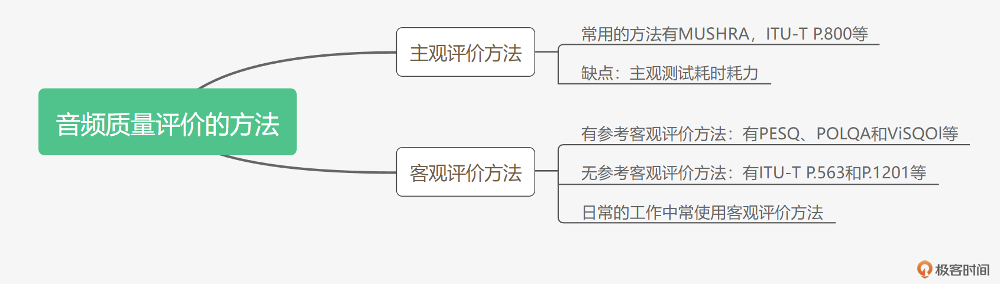
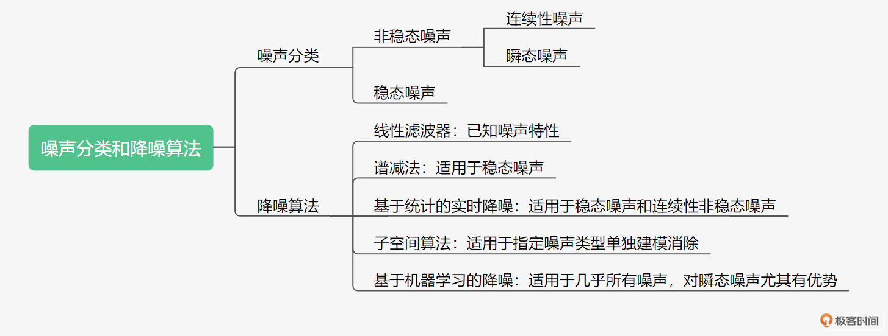
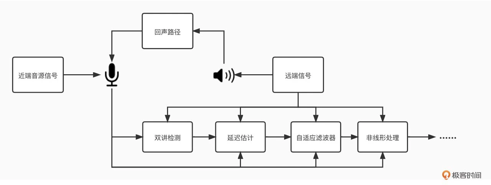
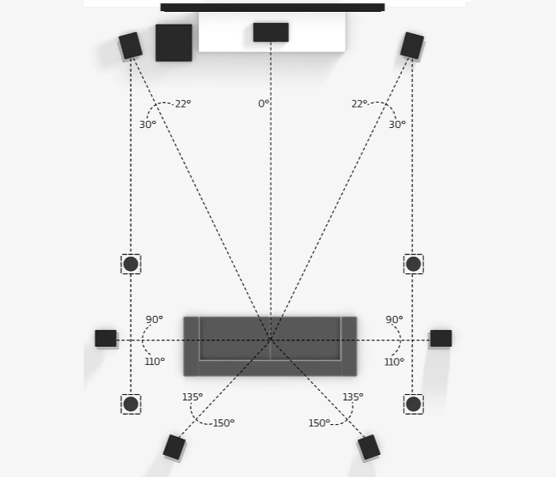

# 01｜声音是如何保存成数字信号的？

根据奈奎斯特采样定理在进行模拟 / 数字信号的转换过程中，当采样频率 fs 大于信号中最高频率 fmax 的 2 倍时（fs > 2fmax），采样之后的数字信号才可以完整地保留原始信号中的信息。也就是说采样率和保留的声音频率基本上是 2 倍的关系。

这里通道数的物理含义其实就是同一时间采集或播放的音频信号的总数。

首先，采样位深、采样率、通道数是描述音频信号的关键指标。采样位深越深、采样率越高，则音质越好，但同时消耗的存储和传输的资源也就越多。

其次，在编码封装时如果需要尽量缩小存储音频的体积，那么可以选用 MP3 等有损的编码封装格式，而需要无损、高保真的音频时，则可以采用例如 FLAC 等无损格式来编码封装。其中对于音频开发者而言，WAVE 格式由于可以迅速快捷地封装一个音频裸数据文件而被广泛使用。

最后，在实际使用时我们就可以根据自己的使用场景来选择音频信号的关键指标和封装形式了。

记住，音频信号主要是用来给人听的，在音频处理时往往需要“眼看为虚，耳听为实”。你可以多听听不同的采样率，不同的采样位深会有什么样的听感。听着听着就会形成记忆，以后解决问题时，你甚至只需要听一耳朵就能发现问题。

# 02｜如何量化分析语音信号？

时域就是信号幅度和时间的关系，而频域指的是能量与时间和频率的关系。

声带振动产生的基波，在传输过程中会在声道表面反复碰撞反射，从而产生许多频率倍数于基频的声波，我们通常把这些声波叫做谐波。

通过共振峰的位置和能量分布来识别音频代表的语音。

我们一般采用加窗，即在原有信号中乘一个两端为 0 的窗信号，来减少截断信号时的频谱泄漏。

由于语音的能量随时间的变化较快，比如能量小的时候可能就是没有在说话，而能量大的地方可能是语音中重读的地方。因此，短时能量常被用来判断语音的起止位置或者韵律。短时能量分析的定义如公式 1 所示：

第 n 个点的短时能量 E_n 就是由加窗后的采样信号的平方和来表示的

将短时能量和短时平均过零率结合起来判断语音起止点的位置。在背景噪声较小的情况下，短时能量比较准确；但当背景噪声比较大时，短时平均过零率有较好的效果。因此，一般的音频识别系统就是通过这两个参数相结合，来判断待检测语音是否真的开始

我们是把短时傅里叶变换的结果对复数频域信号求模，并取对数转换成分贝（dB），然后用热力图的形式展示出来

最后，给你介绍一个常用的 Python 音频处理工具librosa

关于语音是如何产生的、在信号层面有何不同、语音是如何被人耳感知的这些都是这节课的重点。有了扎实的理论基础和分析方法，以后你再碰到语音算法设计、语音特征分析时就可以有针对性地进行选择了。现在我给你简单总结一下，我们今天主要讲了哪些内容。

- 语音根据发音原理的不同可分为清音和浊音，并且根据它们在频谱图上的分布规律，我们可以从频谱上分辨清浊音。
- 只有浊音才有基频和谐波。我们将发浊音时声带振动产生的声音叫基波，并且将基波的频率叫做基频。基频对应我们平时所说的音调，而谐波是频率倍数于基频的声波。
- 共振峰表示发音受腔体形状影响。共振峰的位置和幅度可以和发音一一对应，从而我们可以通过共振峰的位置和能量分布来识别音频代表的语音。
- 在做音频分析的时候需要对音频信号进行截断，而这会导致频谱泄漏。加窗可防止频谱泄漏。
- 短时能量和短时平均过零率是时域分析的常见指标。它们可用于判断清、浊音以及语音的起止位置。
- 频域分析常使用短时傅里叶变换和梅尔谱等方法，并且梅尔谱更能反映人耳的实际听感。

# 03｜如何分析与处理音乐信号？

大调中，每两个音之间的音程大小，依序为全 - 全 - 半 - 全 - 全 - 全 - 半，这就是大调的组成规则，而小调中每两个音之间的音程大小，依序为全 - 半 - 全 - 全 - 半 - 全 - 全。

调音只有以半音为单位来调节伴奏，才能匹配到正确的调式所需的基频频率

音乐中乐器主要包括打击乐器、弦乐器和管乐器，它们的发声原理各不相同。不同的乐器的发音频率、范围也不一样。音乐信号经常会是多个乐器和人声的多信号的混合信号，所以在音乐信号分析时与语音信号分析有所不同。我们通常需要一个采样率覆盖范围比较广的采集设备和一个采样率支持范围比较广的音频编 / 解码器，来保证音乐信号的频段不会丢失。

音乐的速度、节拍和调式等都是在音乐创作时就确定了的，任何一个乐器或者人声没有按照指定的基频频率和出现时间就会导致音乐的不和谐，比如“走调”，从而影响听感。

在音乐场景中需要注意的问题其实还有不少是在降噪、回声消除、编 / 解码等音频环节出现的，比如降噪算法可能会导致有些音乐信号的失真甚至消失，而回声消除可能会导致音乐的不流畅。

# 04｜如何评价音频质量的好与坏？

主观测试是音频评价的黄金准则

主观打分标准

https://github.com/audiolabs/webMUSHRA

在测试语料中混入无损音源作为参考（上限），全损音源作为锚点（下限），通过双盲听测试，对待测音源和隐藏参考音源与锚点进行主观评分

我们先来看一下有参考的客观评价方法。在 2001 年，ITU-T P.862 标准定义了有参考客观评价算法 PESQ（Perceptual Evaluation of Speech Quality，语音质量感知评价），该算法主要用来评估窄带（8kHz 采样率）及宽带（16kHz 采样率）下的编解码损伤

不需要参考信号，仅通过对输入信号本身或参数的分析即可得到一个质量评分。比较著名的无参考客观评价方法有 ITU-T P.563、ANIQUE+、E-model、ITU-T P.1201 等

购买一套 POLQA 设备的价格都是百万级的，为了方便使用，你还可以考虑一下使用例如ViSQOL 等开源算法，也可以支持 48kHz 的音频采样率

注意客观测试目前只能测量音频的损伤程度，比如我们平时在选择编解码器时不知道选择什么类型、多少码率，这时不妨跑一下 PESQ 或者 VisQol 看一下分数。而对于一些偏主观的测试类型，比如音乐听感、耳机效果等，则一般还是需要依靠主观测试。主观测试有时候也不需要你自己组织，你也可以采用众包等方式把测试分发出去。针对这种分发式的主观测试，最近的 ITU-T P.808 也有详细的测试流程和方法，如果你有兴趣，可以自行了解一下。

# 05｜音频降噪如何对症下药？

加性噪声与信号之间满足加性条件，即加噪信号是由噪声和源信号相加得到的，这种情况下信号和噪声是不相关的，我们常见的自然噪声、人造的噪声如电子元器件发出的热噪声等都是这种。

稳态噪声：比如手机、电脑之类的设备底噪、电脑散热器的风扇声等等。它们一直存在且基本上响度、频率分布等声学特性都不随时间变化或者变换缓慢。 非稳态噪声：比如开关门的声音、背景的人声、门铃声等等。这些噪声的统计特性随时间而变化。就好像你在一家餐馆里很多人在说话，还时不时掺杂着吃饭的时候碗碟碰撞的一些声音。 非稳态噪声按照是否连续又可以再分为连续性非稳态噪声和瞬态噪声，比如持续性的背景人声就是连续的噪声，而一些敲击声只会出现极其短暂的时间则为瞬态噪声.

线性滤波器的处理方法算力要求十分低，但必须事先知道噪声会在哪个频段出现

维纳滤波是根据最小均方误差 MMSE 准则（滤波器的输出信号与需要信号之差的均方值最小）设计的线性滤波器

这里就不一一展开了，内容很多，具体每一步怎么做你可以参考 Google 的WIPO 专利（Noise Suppression Method and Apparatus Using Multiple Feature Modeling for Speech/noise Likelihood），里面和 WebRTC 开源库中的代码基本可以一一对应

那么为了区分人声和非人声就需要做一个人声判别也就是我们常说的 VAD（Voice Activity Detection）。这里的 VAD 就是利用几个人工提取的特征来进行统计得出的语音存在概率来判断的。这几个特征包括：频谱平坦度（Spectral Flatness ）， 频谱差异度（Spectral Difference），以及根据先验、后验信噪比的差异得出的似然因子 LR（Likelihood Ratio）Factor。具体如图 3 所示

它是由 Israel Cohen 提出的音频降噪算法。OMLSA 是对人声进行估计，通过先验无声概率及先验信噪比 SNR 的估计来得到有声条件概率，从而实现了对人声谱的估计。IMCRA 则是通过信号的最小值跟踪，得到先验无声概率估计和先验信噪比估计，来计算得到条件有声概率，进而获取噪声谱的估计。

你可以针对不同的噪声类型选择合适的降噪算法。在实际使用的时候还必须结合应用场景的需要来权衡算法的复杂度来解决主要矛盾。比如，现在很多 TWS 耳机都是自带降噪算法的，但是耳机上的 DSP 芯片的算力有限，可能就用单个子空间算法来解决一下耳机常见的风噪就可以了。

还有一些音乐场景我们可能需要牺牲一些降噪性能对降噪的幅度做限制。比如，每个频点最多只能降 3dB，这样来保证音乐信号不会被削弱。所以你在实际的使用中可以从全局出发多问问自己：我应用的场景是什么？我最关心的效果是哪些？

# 06｜如何将AI技术运用到降噪中？

在降噪这个领域，模型的输入是带噪的语音信号，模型的输出是纯净的语音信号

基于频域掩码的 AI 降噪算法的主要步骤如下： 带噪的音频信号经过 STFT 得到频域信号； 频域信号作为输入，利用人工神经网络得到频域掩码； 将第 1 步中的频域信号乘以频域掩码，得到降噪后的频域信号； 将降噪后的频域信号做 STFT 的逆变换得到纯净的语音信号。

AI 模型的输入可以往前看 3 帧，这种方法也就是我们常说的“look ahead”

AI 模型常用的结构包括 DNN、CNN 和 RNN 等。AI 降噪模型在结构设计时，可以选择其中一种，也可以把这些结构组合使用。AI 降噪模型一般采用有监督的训练方式，并以带噪语音作为模型的输入、纯净语音作为训练的目标。利用反向传播结合梯度下降的方法不断提升模型预估和纯净语音的相似程度。这个相似程度我们一般用，例如 MSE 等形式的 Loss 来表示，并且 Loss 越小，模型得到的结果就越接近于纯净语音。

和传统降噪类似，基于频域掩码的 AI 降噪模型是目前最为常用的 AI 降噪设计。纯净语音频谱的获得，需要对幅度谱和相位谱都进行修正。但如果是在移动端部署 AI 降噪模型，受算力影响，基于幅度谱的 AI 降噪模型可能是最好的选择。

在实时音频信号系统中，降噪模型需要考虑到模型的因果性。在移动端部署时，由于算力和存储空间受到限制，我们需要通过对模型的输入进行降维、模型参数进行量化等操作来进行设备适配。当然我们也可以通过一些现成的工具来快速实现 AI 降噪模型的部署。

在实践中，如果你要自己训练一个 AI 降噪模型，那么数据库（语音、噪声）是不可少的。正好在最近的DNS challenge的降噪比赛里，主办方为我们整理了不少语音、噪声等数据库，有兴趣可自行了解一下。

AI降噪算法：

- https://xueshu.baidu.com/usercenter/paper/show?paperid=59c4974257a4dc741c3145275eedbcf1&tn=SE_baiduxueshu_c1gjeupa&ie=utf-8&site=baike
- https://xueshu.baidu.com/usercenter/paper/show?paperid=1f3q0gx08m160as0364500g01k643100
- https://xueshu.baidu.com/usercenter/paper/show?paperid=cf4024fe7a244ddd949b195443a86ce1&site=xueshu_se
- https://xueshu.baidu.com/usercenter/paper/show?paperid=1w400pe0jn5k0t20tt0b0p30km748020&site=xueshu_se
- https://xueshu.baidu.com/usercenter/paper/show?paperid=134f0gg0by2q04y04r4c0cs04x447781&site=xueshu_se
- https://xueshu.baidu.com/usercenter/paper/show?paperid=1x4e00107v100xf0j01g0810em681402&site=xueshu_se

https://github.com/microsoft/DNS-Challenge

# 07｜如何通过算法自动快速地消除回声？

那么我们是如何让算法自动快速地进行回声消除呢？AEC 技术经过半个多世纪的发展，在不断的实践中已经摸索出一套以自适应滤波为基础的回声消除方法。自适应滤波的核心思想就是用实时更新的滤波器的系数来模拟真实场景的回声路径，然后结合远端信号来估计出回声信号，再从近端采集的混合信号中减去估计的回声，从而达到消除回声的目的

NLMS 相对于 LMS 通过归一化的方式提升了算法的收敛速度。

由于采集和播放设备的耦合，在实时音频互动领域，回声消除是实时音频链路中重要的一环。常见的回声消除流程包括双讲检测、延迟估计、线性回声消除、非线性回声消除等步骤。这里可以用一个流程图（图 2）来总结一下，帮助你整体理解 AEC 的算法过程。

图2 回声消除的基本步骤

回声消除发展了几十年，依然还是一个比较热门的研究领域。究其原因还是因为它的复杂性，设备、环境、工程部署的实时性甚至是其它的音频模块都可能会对回声消除的效果产生影响。我们一般把回声消除模块放在紧挨着音频采集模块的位置。也就是说，做完了 AEC 再做降噪、增益调整等其它的音频模块。这样可以尽量减少音频处理对回声路径的复杂性的增加。

回声消除算法其实是在已知一个音源信号的条件下，在多音源混合的音频中消除这一音源。所以有的时候回声消除也被用来做一些音源分离的事情。比如一首歌你已经有伴奏的情况下，对人声和伴奏混合在一起的歌曲，用回声消除就可以提取到清唱（也就是没有伴奏的纯人声）。

# 08｜回声消除算法实践指南

“3A”处理，包括了 AEC（回声消除）、ANS（降噪）、AGC（音频增益控制）这 3 个部分。

自适应滤波器耗时最长的就是卷积计算。而卷积计算是可以采用 FFT 来进行加速计算

相比较于 Speex 这种主要为 DSP 设备服务的算法，WebRTC 中的 AEC 由于考虑到要适配不同的设备终端，所以相比于 Speex，其主要增加了延迟估计和非线性处理这两个步骤来提高 AEC 算法的鲁棒性。那么 WebRTC 中 AEC 算法里的非线性处理是怎么做的呢？

回声消除作为实时音频处理链路中的重要的组成部分，和其它模块的表现会相互耦合，并且每个模块摆放的位置、处理的方法都可能对实时音频的整体体验产生影响。而房间的混响、非线性处理等方面都是我们可以改进回声消除效果的方向。

其实[Speex](https://www.speex.org/)和[WebRTC](https://webrtc.org.cn/) 的开源已经让整个 AEC 的发展前进了一大步。利用起来后就再也不用从零开始搭建回声消除算法了。Speex 主要采用了前景滤波器和背景滤波器的双滤波器结构，这样的结构能更好地防止滤波器发散，使得在处理双讲时效果更鲁棒。但是 Speex 没有 NLP 部分的处理，所以在面对非线性问题时就会捉襟见肘。

比较可惜的是 Speex 目前已经停止更新，所以一般基于 Speex 的项目都会自行再做一些非线性的处理。而 WebRTC 的线性部分只有单路滤波器，较 Speex 略弱，所以主要靠 NLP 部分的处理来提升整体效果。但其实，最近更新的 WebRTC aec3 的算法中也使用了基于 NLMS 和卡尔曼滤波，双滤波器的结构，这使得线性部分能够得到进一步的加强。

另外，我们看到非线性部分还需要一些人工的经验数值来做一些状态判断和 overDrive 等操作。而实际上基于传统算法的 AEC 很难彻底解决由于环境、设备等时变性、非线形导致的不稳定的问题。

因此，最近几年基于机器学习的方法被用到了 AEC 的领域。尤其是在 NLP 的部分，和之前讲的降噪模型类似，基于机器学习的模型可以把 AEC 线性部分的结果作为输入，结合近端和远端的信号自动进行残余回声的消除，这里你可以参考一下最近举办的[AEC challenge](https://github.com/microsoft/AEC-Challenge)的比赛，里面有很多优秀的论文和数据可以参考和使用。

# 09｜音频编解码器是如何工作的？

音乐编 / 解码器基本都会选择在频域上对信号进行频域编码

两种编 / 解码架构又再次走到了一起，即语音音乐混合编码器。

G.711 中的 A-LAW 就是采用非线性量化的方式对每个采样点进行压缩。

这里我们常采用线性预测编码（LPC）。

也就是说在编码传输的时候我们需要传递 LPC 系数和残差这两个部分，才能在解码时将语音比较好的还原出来。

VQ 是一种基于块编码规则的有损数据压缩方法。

事实上，在音视频中的 JPEG 和 MPEG-4 等多媒体压缩格式里都有 VQ 这一步。它的基本思想是：将若干个标量数据组构成一个矢量，然后在矢量空间给以整体量化，从而压缩了数据。

VQ 所需的码本是通过大量的离线语料训练得到的。

离散余弦变换（DCT）在音、视频编码中都是常用的降维方法，对其内部原理有兴趣的同学可以自行了解一下。MDCT 其实就是时域重叠的 DCT 变换，主要是为了消除 DCT 带来的块效应。MDCT 的正、逆变换可以参照图 3。

从 DCT 系数中去除未量化频段的能量值，产生的剩余信号的系数部分是通过金字塔矢量量化（PVQ）来编码的。这种编码方式使用固定（可预测）长度的码字，从而对比特位错误有更好的鲁棒性。CELT 将频带的能量分为粗粒度能量和细粒度能量，并且两者相加为整体的频带能量。而在编码时可根据想要编的码率来调节粗细力度的码率分配，这样就可以兼容不同的码率设置。具体 CELT 的编码流程如图 5 所示：

这一讲我们主要介绍了一些音频编 / 解码的基本原理。音频的编 / 解码主要有语音编 / 解码、音乐编 / 解码和混合编 / 解码。其中通用的编 / 解码方法有非线性量化、减少采样率、矢量量化等方法。对于语音信号可以使用声道模型建模，然后采用线性预测加残差的方法来进行编 / 解码，而对音乐信号则需要根据人耳敏感频响曲线分频带来建模。

其中，在 WebRTC 中默认使用的编 / 解码器 OPUS 就是这类编 / 解码器。其语音主要采用 SILK 来编码，音乐则采用 CELT 来编码。在 OPUS 内部还有一个基于人工神经网络的音乐判断器来进行人声和音乐的自动切换，从而达到最好的编 / 解码效果。

其实在音频编 / 解码领域有很多成熟而优秀的编 / 解码器，初学者不要被这些复杂的数学、声学、心理学知识所吓到。我们完全可以在掌握编 / 解码器原理的基本概念之后根据自己的场景，选择一些成熟的编 / 解码器来使用，具体怎么选我们将会在下一讲中详细介绍。

# 10｜如何选择一个适合你的编解码器？

这个端到端的延迟包括了设备采集播放的延迟、音频处理算法引入的延迟、编 / 解码引入的延迟和网络传输的延迟。

在你挑选音频编 / 解码器的时候，常见的需要关心的指标主要是码率、音质、计算复杂度、延迟等。一般来说相同码率的情况下，音频编 / 解码器的音质越好、复杂度越低、延迟越小，编 / 解码就越好。但编 / 解码器的码率和通道数等都是可调节的，且音频编 / 解码器的选择是需要根据不同场景来综合考虑的。

文中我给出了两个具有代表性的案例：

- 会议场景，主要追求的是互动的流畅，所以我们会选择延迟较小的、音质一般的音频编 / 解码器，比如 OPUS。
- 音乐场景，除了高码率保证音质外，还需要多声道来保证音频的空间感，我们可以使用双声道、甚至多声道的编 / 解码器，例如 AAC 来实现。如果你对音频中如何还原空间感还有疑问，不要着急，我会在后面的课程为你详细介绍。

其实，最近还有很多基于 AI 的音频编 / 解码器相继发布，可以说基于 AI 技术的编 / 解码器在如何使得码率更小、音质更高上是一个不错的研究方向。

例如，Google 发布的 Lyra，Sound stream，以及微软发布的 Satin。另外，我在声网也研发了国内第一个基于 AI 的语音编 / 解码器[Silver](https://mp.weixin.qq.com/s/b6f6e9B4-AjRVZRHRzxdcQ)，它可以用 3.6kbps 实现 32kHz 采样率的语音的编 / 解码。你可以看到基于 AI 的编 / 解码器可以把码率降到一个很低的水平，同时又保持较高的音质。有兴趣你可以通过链接自行了解一下。

# 11｜网络差怎么办？音频网络传输与抗弱网策略

相较于 TCP 协议，UDP 提供了一种无需建立连接，就可以发送封装的 IP 数据包的方法。\

这里你需要注意的是：音频前向纠错遵循 RFC-2198 标准；而视频前向纠错遵循 RFC-5109 标准。音频由于数据包相比视频要小的多，可以直接用完整的音频包做冗余，而不是像视频用一个分辨率比较差的小数据包做冗余

让我们再看看另一种 FEC 的方法：RS-FEC，RS 码即里德 - 所罗门码（Reed-solomon Code

相反的，如果在缓存中的数据就快播放完了但新包还未送达，那么这时候就需要慢速的方法来把音频时长拉长。这里用到的同样是变速不变调的算法，即只改变音频的播放速度而不改变音频的音调。

这里你需要注意和前面的慢放相区分。慢放虽然也可以增加音频的长度但一个慢放系数比例确定后，慢放所能增加的音频长度也就固定了，所以一般慢放用于解决需预测时间比较短的音频的拉长。而 PLC 具有可扩展性，所以一般负责整个一帧或者多帧的，长时间的丢包补偿。

弱网的情况在实时音频领域中是不可避免的一类问题。它主要表现为丢包、延迟和抖动这三个常见现象。为了能在弱网情况下继续保持音频的流畅播放，我们分别从网络丢包控制这一网络传输条件下的通用解决方法，和 NetEQ 这种音频独有的抗弱网策略这两块来解决弱网问题。

其中，网络丢包控制比较常见的方法有前向纠错 FEC 和自动重传请求 ARQ 这两种。需要注意的是，这两种方法都是以增加网络带宽消耗的方式来提升弱网的能力的。因此，如果在网络带宽本身比较差的情况下，就可能导致适得其反。而 NetEQ 则是通过一些音频处理方法，比如快慢放、PLC 等方法来解决抖动和丢包的问题。

我们可以看到，NetEQ 中通过多个 Buffer 缓存以及快慢放的形式引入了延迟，从而提升了抗网络抖动的能力。然后通过 PLC 的方式解决丢包带来的音频卡顿。这与 FEC 和 ARQ 相比无需额外的带宽消耗，但是却增加了延迟。

实际上抗弱网我们也叫作音频的“最后一公里”(Last-mile)，并且它是保证音频传递的重要组成部分。其实在实际使用中你可能需要针对自己的场景进行一些调整，比如说对于流畅通话比较重要的会议等场景，可以把 NetEQ 中的缓冲 Buffer 适量增大，这样可以进一步提升抗网络丢包的能力。但是 Buffer 也不能太大，这样会导致过多的延迟，从而影响通话效果。

我们也可以在 NetEQ 中引入网络抖动情况的估计，比如在网络抖动严重的时候，动态增加 NetEQ 的 Jitter Buffer 的大小，而网络情况较好的时候减少一些 Jitter Buffer 的大小，从而降低延迟，这些都是可以改进的策略。

# 12｜空间音频入门：如何实现“声临其境”？

所谓空间音频的技术，就是把现实中这些对声音的感知，能够用空间音频采集设备和播放设备还原出来。

这其实就是空间音频里常说的“双耳效应”，即依靠双耳间的音量差、时间差和音色差来判别声音方位的效应。

入耳式麦克风和人工头采集的区别其实也显而易见的。如果你用入耳式麦克风采集的音频再用入耳式耳机播放，那么基本上可以做到完美还原。而如果是用人工头录制，那么由于耳廓的形状、头的形状等都和你自己有所不同，所以虽然可以做到很大程度上的空间还原，但和你自己实际到场景中去听，还是有一些差别的。

Ambisonics 技术在 AR、VR 等需要转动视角的场景里可以很好地还原整个声场的听感，所以被广泛应用。

其实这里我们可以把数字分成 A.B.C 三个部分。其中，A 代表有多少个环绕声扬声器（前置、中置和环绕）的数量；B 表示有多少个超低音音箱；C 代表顶部或向上发声扬声器的数量。

举个例子，如图 7 所示，这是一个 Dolby 7.1.4 声道的全景声音箱系统。其中环绕扬声器是其中长方体表示的左前、中置、右前、左、右、左后、右后共 7 个环绕扬声器。超低音音箱是左上方的正方形，它一般都是用于增强 200Hz 以下的超低频率的声音，并且由于低频部分的声波波长较长，在房间内方向的感知不明显，所以方位上来说只需要放在房间中的任意位置即可。而在顶部的扬声器一般在听音位置也就是图 7 沙发的上方均匀排布（黑色圆形），用于提供来自上方的声音渲染。

首先，我们对空间内声音的位置的感知是因为我们的耳廓形状和双耳效应。对空间中不同位置传来的声音，左右耳会得到不同的音色、音量以及延迟变化。距离感则主要是声音的相对音量大小以及声波空气衰减时，高频衰减快于低频导致的频率能量变化来感知。而听混响的持续时间则是我们感知所处空间大小的方法。

空间音频的采集可以使用入耳式麦克风或者人工头的形式来录制可用耳机回放的立体声。而 Ambisonics 技术则可以采用 Ambisonic 麦克风来对整体空间声场进行采集，然后通过后期的渲染来自由调整听音的方向。

这里我想补充一下，在影视制作或者现场录制的时候你可能会采用一些所谓的立体声录制麦克风。比如常见的 A-B 式麦克风、X-Y 式麦克风等，这些录制方式可以采集双声道的立体声信号。这些声音是双声道，虽然你可以听出一些方位感和空间感，但是也可以作为简易的现场录音的方法的，只是这些立体声的录制无法通过后续播放来精准还原现场的声场。

所以在这节课里我没有把它归入空间音频的录制方法里。但这些立体声麦克风采集的音频，回放空间听感效果还是会优于单声道麦克风，所以在无需完美还原的场景里，也是可以使用的。

最后，想要感受空间音频逼真的方向感和空间感我们可以使用耳机、环绕声或者全景声音箱的形式来进行回放。其实单声道的声音经过空间音频算法的渲染也可以让人有“声临其境”的感觉，我会在下节课为你详细讲解。思考题

# 13｜如何利用HRTF实现听音辨位？

用得到的冲击响应和原始音频做卷积就可以做混响的渲染了。

为了实现听音辨位，我们可以使用 HRTF 对空间音频进行渲染。

- 直达声可以采用预先采集的 HRIR 和原始音频通过卷积的方式来实现。基本上需要哪个方向的声音就去卷积哪个方向的 HRIR。HRIR 一般需要全消声实验室进行采集，我们可以使用一些开源库中的 HRIR 来实现。
- 反射声或者说混响的渲染则是采用卷积房间冲击响应 RIR 的形式来实现。由于 RIR 和房间的大小、材料、听音者和音源的位置都有关系，所以一般采用镜像法模拟的形式来实现。
- 在这里我还想补充一点，在实时交互的场景里，空间音频渲染时计算的实时性是很重要的。这里说的卷积和前面回声消除里讲的自适应滤波器一样，都是可以用频域卷积来加速的，比如采样率是 48kHz 的音频。如果需要和超过 64 点以上的卷积核做卷积，那么用频域卷积会快于时域卷积。

# 14｜音效三剑客：变调、均衡器、混响

我们要变调，其实就是把这个循环周期进行扩大或者缩小。

其实 OLA 的思想和 STFT 中的 Overlap 的思想很相似。

如图 3 所示，拼接的信号会出现时高时低的现象。所以如果我们能实时的根据信号本身的自相关属性，也就是把信号中相似的两段直接拼接在一起，这样就不会有相位的问题了。基于这样的思想，于是就有了波形相似叠加 WSOLA（Waveform similarity Overlap-Add）算法。

其实均衡器就是一组滤波器，比如常见的高通、低通、带通、带阻等形式。

改变声音可以从三个基本的方向来修改，也就是改变音调、音色和混响，分别对应了变调、均衡器和混响这三种算法。

其中变调算法比较常用的有：基于拼接的 OLA、WSOLA 以及频域的 Phase Vocoder 等。而均衡器主要是通过一个滤波器组对不同频段的能量来进行调节，成熟的算法有很多，但大多是 FIR 或者 IIR 滤波器的组合。人工混响则是可以采用多个梳状滤波器的滤波器组，串联全通滤波器来实现，比较常见的有 Scheoeder 和 Moorer 混响模型。

当然音效的种类还远不止这三种，这节课只能算是音效的常见算法的入门。在这里再和你分享一个音效的网页 demo，里面有声网研发的各种声音效果。你可以通过[链接](https://www.agora.io/cn/audio-demo)感受一下，看看音效还能做出什么不同的效果。

# 15｜AI变声：音频AI技术的集大成者

目前在工业界，使用的最多的是基于Kaldi 开源框架的算法

比如ESPNet 开源项目里就整合了许多基于 CTC、Transformer 等技术的端到端开源模型

那说到 TTS，就不得不提及 Google 发表的两篇重要论文，一个是WaveNet 声码器，另一个是声纹识别到多重声线语音合成的迁移学习。其中 WaveNet 声码器首次把语音合成的音频结果提升到了和真人说话一样的自然度，而 VPR 结合 WavNet 则是实现了端到端的文字到语音的生成。你可以在链接中找到这两篇论文

其中说话人的音色和发音习惯等声纹信息，可以通过一段事先准备好的说话人语料和一个 Speaker Encoder（说话人编码器）来提取。说话人编码器其实就是我们之前说的 VPR 声纹识别技术，常见的 VPR 技术有 I-vector、x-vector、GE2E、Deep Speaker、RawNet 等。

Synthesizer（合成器）则是通过音素和声纹信息合成出声码器所需的语谱特征。由于图 5 中使用的是 WaveNet 系列的 Vocoder，所以需要的是对数梅尔谱（log-mel spectrogram）作为声码器的输入。合成器也有一些现成的框架可以使用，比如 Google 的 Tacotron、微软的 Fastspeech 等。其实合成器的原理都大致相同，就是利用 AI 模型对音素序列进行编码，然后和声纹特征融合在一起，再通过 Decoder 模型得到声码器需要的输入特征。

录制一段 A 的声音； 通过 VPR 得到一个 A 的声纹（Speaker Embeding）； 录制一段自己的声音； 用自己的声音通过 ASR 得到音素序列； 利用 TTS 的合成器把 A 的声纹和 ASR 得到的音素序列转换为声码器需要的特征； 利用声码器得到变声后的音频

答案是有的，尤其是基于 GAN（Generative Adversarial Networks）技术的变声模型，例如Cyclegan、Stargan 等模型，都在变声领域实现了端到端的变声方案

相比于传统算法，基于 AI 模型的变声可以动态地根据发音的内容来对语音进行调整，从而实现更为自然且逼真的变声效果。基于 AI 的变声模型主要包括了三个模块：ASR、TTS 和 VPR。

Kaldi 是目前最流行的 ASR 框架。Kaldi 利用声学模型和语言模型来综合分析提取语音中的音素和文字信息，从而提升了文字识别的鲁棒性问题。而常见的端到端模型框架可以采用 ESPNet 等开源框架，在实际使用中，目前同等准确性和内容覆盖率的前提下，端到端模型和 Kaldi 框架比较起来算力会更大一些。而且端到端模型如果要针对某个场景做定制时，因为要重新训练模型，所以受到数据的限制可能会更大一些，所以端到端模型目前还没有得到大规模的使用。

TTS 技术中，WaveNet 声码器已经可以让合成语音得到媲美真人声音的自然度。而基于 VPR 声纹的 TTS 技术，可以实现语音音色根据目标声纹来任意替换，这为后续的变声应用提供了一种比较方便的实现方式。

最后，变声技术把 ASR、TTS 和 VPR 技术融合起来，从而实现了高质量的变声系统。在实践中，目前这种基于 ASR、TTS 和 VPR 的变声系统，效果要优于传统音效算法和端到端的 AI 变声算法。但这套系统的算力、存储空间的复杂性还是很高的，在部署和成本方面仍然有很多挑战。

- https://paperswithcode.com/paper/maskcyclegan-vc-learning-non-parallel-voice

- https://paperswithcode.com/paper/stargan-vc-non-parallel-many-to-many-voice

- https://xueshu.baidu.com/usercenter/paper/show?paperid=3b94d755401ea9ace11884cf7bfeafbd

- https://arxiv.org/pdf/1609.03499.pdf

- https://github.com/espnet/espnet

- https://github.com/kaldi-asr/kaldi

  
